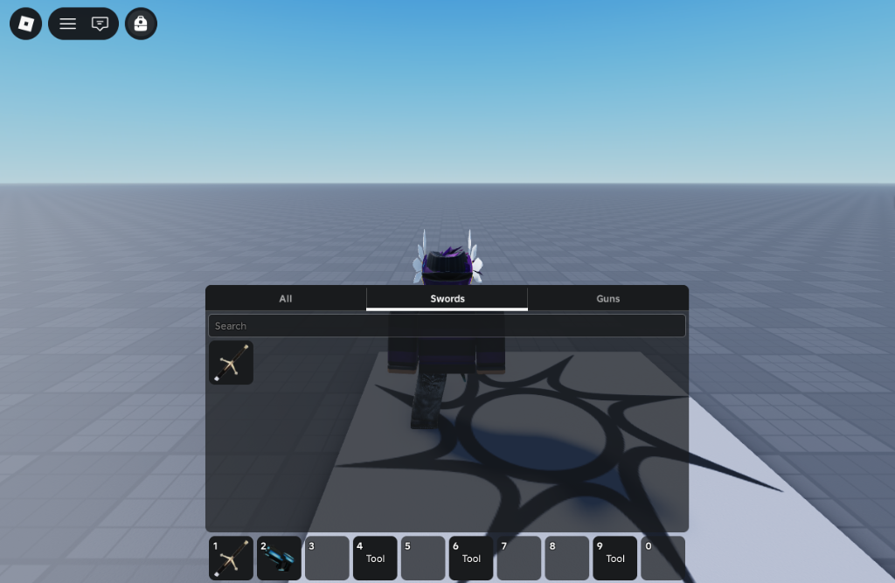

# 🎒 VideBackpack



A modern and reactive backpack system for Roblox, built using [Vide](https://github.com/centau/vide).

---

## ⚡ Features

- **Familiar UI**: Maintains a highly intuitive layout familiar to Roblox players, matching the core interface patterns they expect, but elevated with a sleek, premium, and modern aesthetic.
- **Customizable Themes**: Highly customizable theme properties using `setTheme`. Easily switch between predefined themes (`default` and `white`) or define your own.
- **Total Architectural Freedom**: Highly modular source code. You have absolute freedom to edit, extend, or rewrite UI components to match any unique design or specific gameplay behavior.
- **Custom Categorization**: Group your inventory items into tab categories (e.g., Weapons, Potions, Resources) using simple, custom declarative predicate functions.

---

## 📦 Installation

### Github Releases

1. Download the `VideBackpack.rbxm` model file from the [Github Releases](https://github.com/GuiRios7/VideBackpack/releases).
2. Open Roblox Studio and create a new place or open an existing place.
3. In the Explorer window, insert **VideBackpack** into **ReplicatedStorage**.
4. Select the **VideBackpack** model file you downloaded from GitHub.

**VideBackpack** uses [RunContext](https://devforum.roblox.com/t/live-script-runcontext/1938784) to run anywhere, so you do not need to move it from Workspace, though it is recommended to parent it to **ReplicatedStorage** for better practices and organization.

### Wally

Add **VideBackpack** to your `wally.toml` dependencies:
```toml
[dependencies]
VideBackpack = "encodedlux/vide-backpack@0.1.0"
```
Then, run `wally install` in your project folder.

---

## 💡 Usage

### 1. Basic Setup
Initialize VideBackpack in your client script:
```lua
-- Require VideBackpack to run startup
require("@game/ReplicatedStorage/Packages/VideBackpack")
```

### 2. Registering Custom Categories
Group items dynamically based on tag configurations or attributes:
```lua
const VideBackpack = require("@game/ReplicatedStorage/Packages/VideBackpack")

-- Category for items tagged as "Consumable"
VideBackpack.createCategory("Consumable", function(item)
    return item:HasTag("Consumable")
end)

-- Category for tools whose name starts with "Sword"
VideBackpack.createCategory("Swords", function(item)
    return string.match(item.Name, "^Sword") ~= nil
end)
```

### 3. Subscribing to Inventory Lifecycles
Track when items are equipped and handle custom mechanics:
```lua
const VideBackpack = require("@game/ReplicatedStorage/Packages/VideBackpack")

const disconnect = VideBackpack.onBackpackEquipped(function(item)
    print("Player is now holding their:", item.Name)
end)

-- Clean up subscriptions when no longer needed (optional)
disconnect()
```

### 4. Changing Themes
Seamlessly update colors, fonts, corner radius, and stroke values on the fly with smooth transition animations:
```lua
const VideBackpack = require("@game/ReplicatedStorage/Packages/VideBackpack")

-- Switch to the light theme (white)
VideBackpack.setTheme(VideBackpack.themes.white)

-- Switch to the default theme (dark)
VideBackpack.setTheme(VideBackpack.themes.default)

-- Or create a custom theme
local customTheme = {
    backgroundColor = Color3.fromHex("#492a17ff"),
    textColor = Color3.fromHex("#e09e74ff"),
    ...
} :: VideBackpack.ThemeConfig

VideBackpack.setTheme(customTheme)
```

---

## 🛠️ API Reference

### Functions

#### `setEnabled(enabled: boolean)`
Enables or disables the custom backpack interface.
- **`enabled`**: Set to `true` to display the UI, or `false` to hide it.
```lua
VideBackpack.setEnabled(true)
```

#### `isEnabled() -> boolean`
Returns whether the custom backpack UI is currently enabled.
```lua
const isEnabled = VideBackpack.isEnabled()
```

#### `openInventory()`
Opens the inventory screen interface.
```lua
VideBackpack.openInventory()
```

#### `closeInventory()`
Closes the inventory screen interface.
```lua
VideBackpack.closeInventory()
```

#### `toggleInventory()`
Toggles the visibility state of the inventory interface.
```lua
VideBackpack.toggleInventory()
```

#### `isInventoryOpen() -> boolean`
Returns whether the inventory screen is currently open.
```lua
const isOpen = VideBackpack.isInventoryOpen()
```

#### `createCategory(name: string, predicate: (item: Tool | HopperBin) -> boolean)`
Creates a custom category filtering items based on the provided predicate function.
- **`name`**: The display name of the category (e.g., `"Weapons"`).
- **`predicate`**: A function that receives an `item` and returns a `boolean` (whether the item belongs in the category).
```lua
VideBackpack.createCategory("Weapons", function(item)
    return item:HasTag("Weapon")
end)
```

#### `getTopbarIcon() -> Icon?`
Returns the `TopbarPlus` icon instance generated by the module.
```lua
const icon = VideBackpack.getTopbarIcon()
if icon then
    icon:setLabel("Inventory")
end
```

#### `setTheme(config: ThemeConfig)`
Sets the active theme configuration.
- **`config`**: The new `ThemeConfig` layout to apply. Individual values are automatically animated using spring physics.
```lua
VideBackpack.setTheme(VideBackpack.themes.white)
```

---

### Events (Hooks)

All event listeners return a **disconnect function** when called, which can be executed to clean up and stop listening to the event.

#### `onInventoryOpened(callback: () -> ()) -> (() -> ())`
Fires whenever the player's inventory interface is opened.
```lua
const disconnect = VideBackpack.onInventoryOpened(function()
    print("Player opened their inventory!")
end)

-- Unsubscribe when no longer needed:
disconnect()
```

#### `onInventoryClosed(callback: () -> ()) -> (() -> ())`
Fires whenever the player's inventory interface is closed.
```lua
VideBackpack.onInventoryClosed(function()
    print("Player closed their inventory!")
end)
```

#### `onBackpackEquipped(callback: (item: Tool | HopperBin) -> ()) -> (() -> ())`
Fires when the player equips an item on character.
- **`item`**: The `Tool` that was equipped.
```lua
VideBackpack.onBackpackEquipped(function(item)
    print("Equipped item:", item.Name)
end)
```

#### `onBackpackUnequipped(callback: (item: Tool | HopperBin) -> ()) -> (() -> ())`
Fires when the player unequips their currently active item.
- **`item`**: The `Tool` that was unequipped.
```lua
VideBackpack.onBackpackUnequipped(function(item)
    print("Unequipped item:", item.Name)
end)
```

#### `onBackpackAdded(callback: (item: Tool | HopperBin) -> ()) -> (() -> ())`
Fires when an item is added to the player's backpack.
- **`item`**: The `Tool` or `HopperBin` that was added.
```lua
VideBackpack.onBackpackAdded(function(item)
    print("Added to backpack:", item.Name)
end)
```

#### `onBackpackRemoved(callback: (item: Tool | HopperBin) -> ()) -> (() -> ())`
Fires when an item is removed entirely from the player's backpack.
- **`item`**: The `Tool` or `HopperBin` that was removed.
```lua
VideBackpack.onBackpackRemoved(function(item)
    print("Removed from backpack:", item.Name)
end)
```

#### `onBackpackEmpty(callback: () -> ()) -> (() -> ())`
Fires when the backpack becomes entirely empty (contains no items).
```lua
VideBackpack.onBackpackEmpty(function()
    print("The backpack is now empty!")
end)
```

---

## 📄 License

VideBackpack is licensed under the MIT License - see the [LICENSE](LICENSE) file for details.