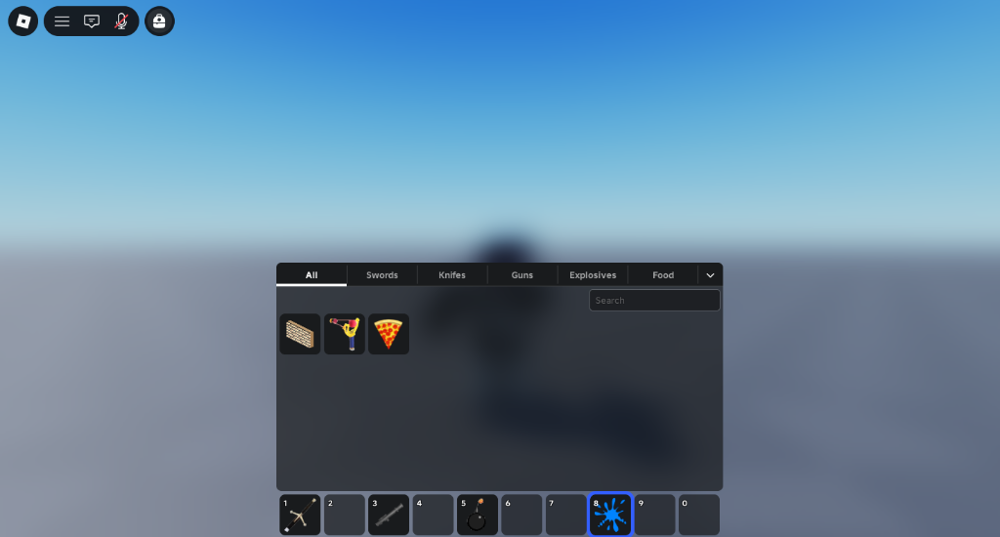

# Sling

A modern and reactive backpack system for Roblox, built using [Vide](https://github.com/centau/vide).



---

## Installation

### Github Releases

1. Download the `Sling.rbxm` model file from the [Github Releases](https://github.com/encodedlux/sling/releases).
2. Open Roblox Studio and create a new place or open an existing place.
3. In the Explorer window, insert **Sling** into **ReplicatedStorage**.
4. Select the **Sling** model file you downloaded from GitHub.

**Sling** uses [RunContext](https://devforum.roblox.com/t/live-script-runcontext/1938784) to run anywhere, so you do not need to move it from Workspace, though it is recommended to parent it to **ReplicatedStorage** for better practices and organization.

### Wally

Add **Sling** to your `wally.toml` dependencies:
```toml
[dependencies]
sling = "encodedlux/sling@0.1.0"
```
Then, run `wally install` in your project folder.

---

## Usage

### 1. Basic Setup
Initialize Sling in your client script:
```luau
-- Require Sling to run startup
require("@game/ReplicatedStorage/Packages/sling")
```

### 2. Registering Custom Categories
Group items dynamically based on tag configurations or attributes:
```luau
-- Category for items tagged as "Consumable"
sling.createCategory("Consumable", function(item)
    return item:HasTag("Consumable")
end)

-- Category for tools whose name starts with "Sword"
sling.createCategory("Swords", function(item)
    return string.match(item.Name, "^Sword") ~= nil
end)
```

### 3. Subscribing to Inventory Lifecycles
Track when items are equipped and handle custom mechanics:
```luau
local disconnect = sling.onBackpackEquipped(function(item)
    print("Player is now holding their:", item.Name)
end)

-- Clean up subscriptions when no longer needed (optional)
disconnect()
```

### 4. Changing Themes
Seamlessly update colors, fonts, corner radius, and stroke values on the fly with smooth transition animations:
```luau
-- Switch to the light theme (light)
sling.setTheme(sling.themes.light)

-- Switch to the default theme (dark)
sling.setTheme(sling.themes.default)

-- Or create a custom theme
local customTheme = {
    backgroundColor = Color3.fromHex("#492a17ff"),
    textColor = Color3.fromHex("#e09e74ff"),
    ...
} :: sling.ThemeConfig

sling.setTheme(customTheme)
```

---

## See the documentation:

- [Documentation](https://encodedlux.github.io/sling/)

## Credits

- Credits to [Purse](https://github.com/ryanlua/Purse) by [ryanlua](https://github.com/ryanlua) for some utility implementations used in this project.

---

## License

Sling is licensed under the MIT License - see the [LICENSE](LICENSE) for details.